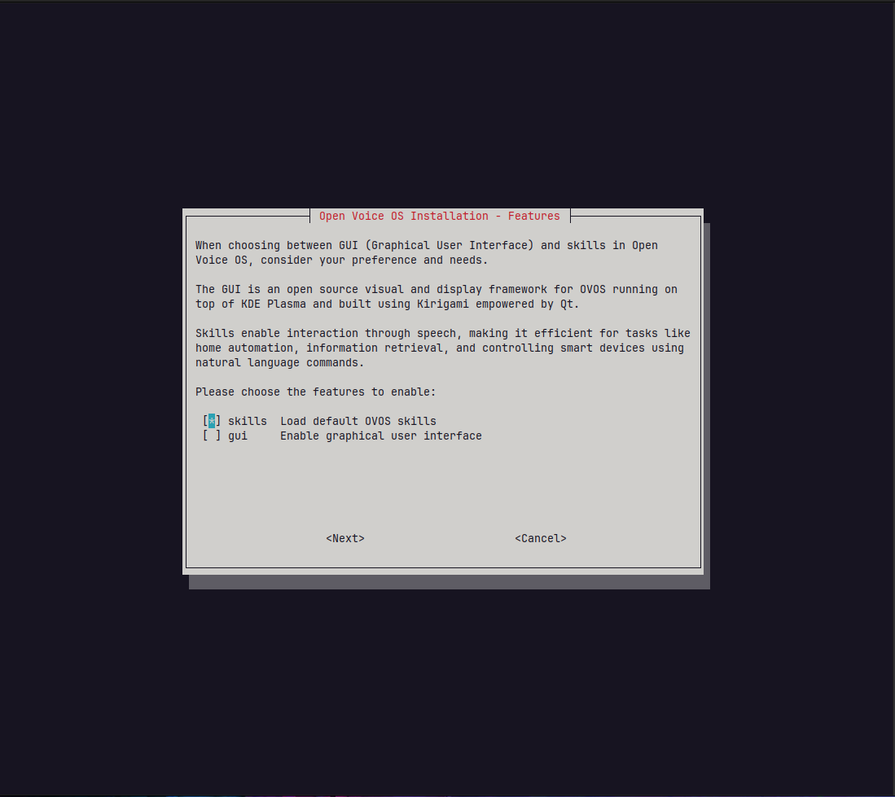

# Open Voice OS and HiveMind Installer

A nice, simple and intuitive installer for Open Voice OS and HiveMind using Bash, Whiptail *(Newt)* and Ansible.

## Quickstart

`curl`, `git` and `sudo` packages must be installed before running the installer.

```shell
sh -c "curl -s https://raw.githubusercontent.com/OpenVoiceOS/ovos-installer/main/installer.sh -o installer.sh && chmod +x installer.sh && sudo ./installer.sh"
```

## Screenshots





