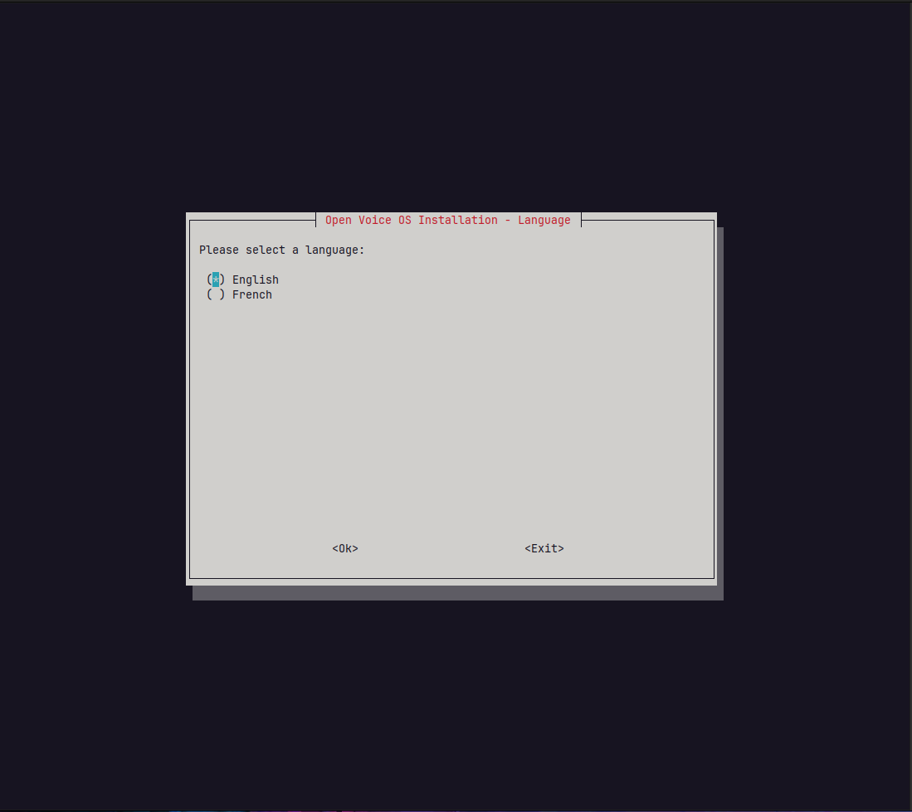

# Open Voice OS and HiveMind Installer

A nice, simple and intuitive way to install Open Voice OS and/or HiveMind using Bash, Whiptail *(Newt)* and Ansible.

## Quickstart

`curl`, `git` and `sudo` packages must be installed before running the installer.

```shell
sh -c "curl -s https://raw.githubusercontent.com/OpenVoiceOS/ovos-installer/main/installer.sh -o installer.sh && chmod +x installer.sh && sudo ./installer.sh"
```

Then follow the instructions display on screen.

## Automated install

The installer supports a non-interactive *(automated)* process of installation by using a scenario file, this file must be created under the `~/.config/ovos-installer/` directory and should be named `scenario.yaml`.


Here is an example of a scenario to install Open Voice OS within Docker containers on a Raspberry Pi 4B with default skills and GUI support.

```shell
mkdir -p ~/.config/ovos-installer
cat <<EOF > ~/.config/ovos-installer/scenario.yaml
---
uninstall: false
method: containers
channel: development
profile: ovos
features:
  skills: true
  gui: true
rapsberry_pi_tuning: true
share_telemetry: true
EOF
```

Few scenarios are available as example in the [scenarios](https://github.com/OpenVoiceOS/ovos-installer/tree/main/scanerios) directory of this repository.

## Screenshots





