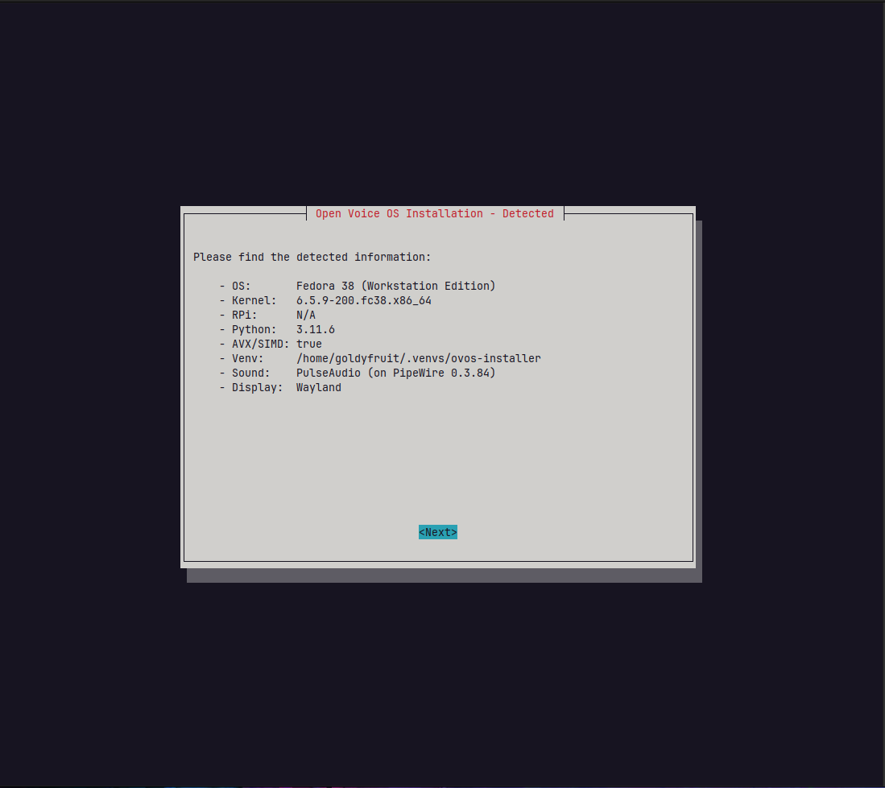
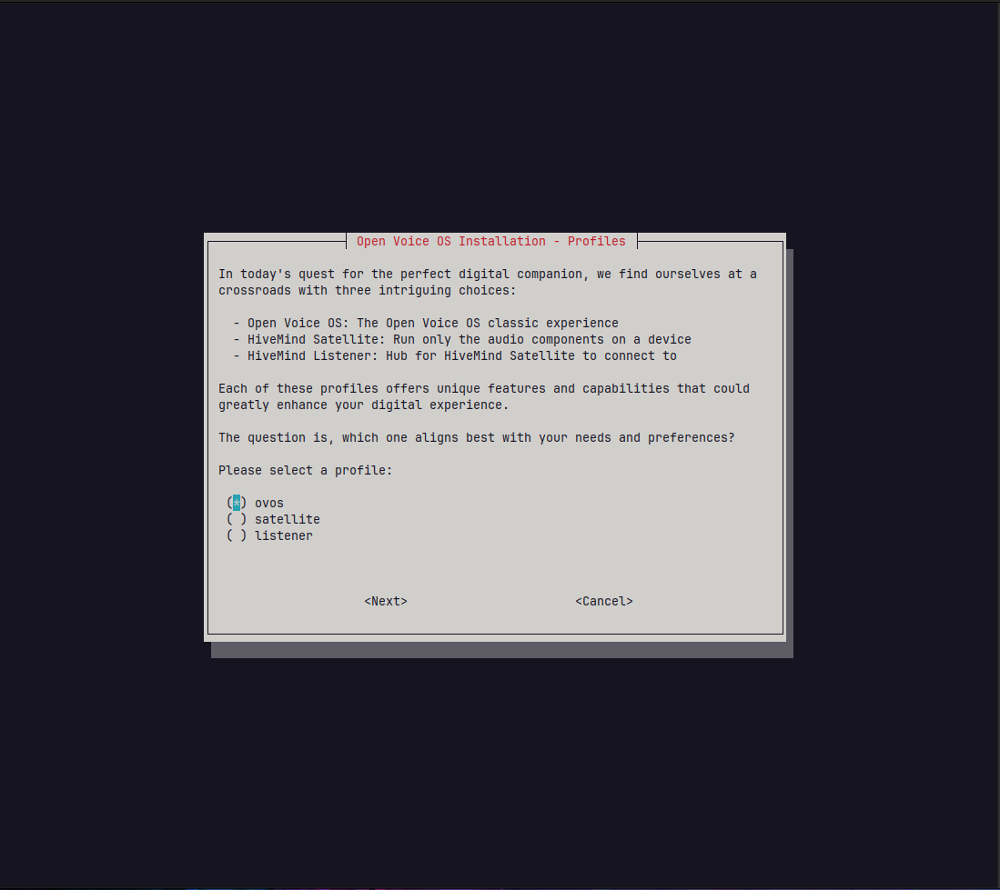
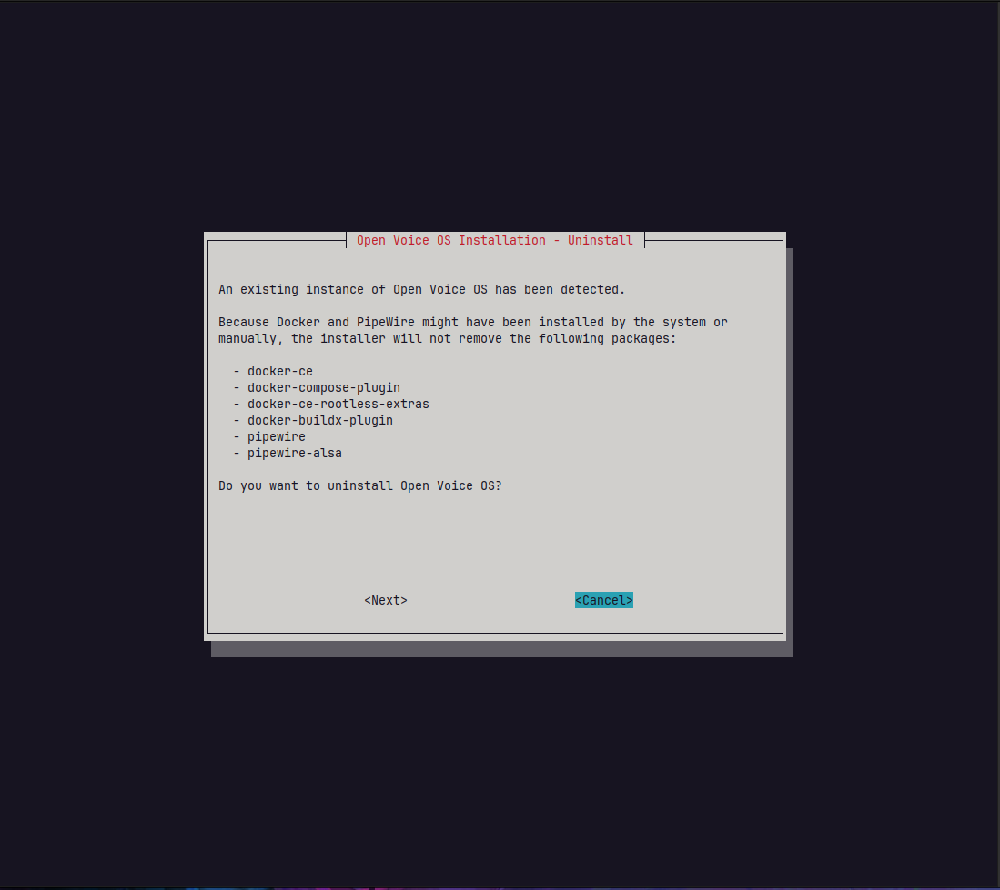
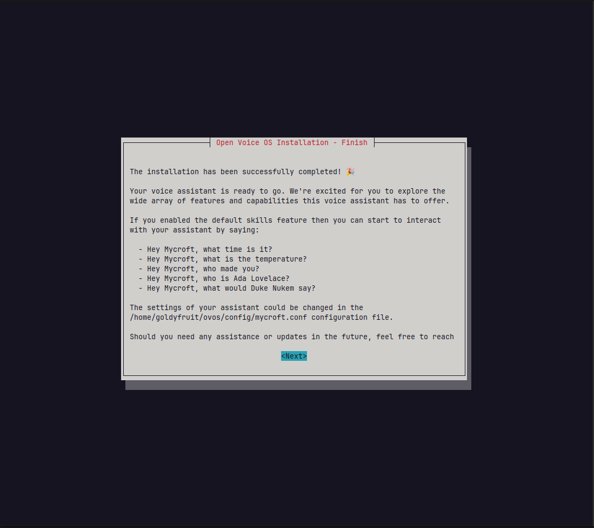

# 🎉 Open Voice OS and HiveMind Installer 🎉

Installer for Open Voice OS (OVOS) and HiveMind on Linux. Supports interactive installs, scenario-based automation, and optional container deployment.

## 🤖 What is Open Voice OS?

Open Voice OS (OVOS) is an open-source voice assistant platform focused on privacy and customization. HiveMind extends OVOS with distributed voice processing across multiple devices.

## 🚀 Quickstart

Prereqs: `curl`, `git`, and `sudo`. Run:

```shell
sudo sh -c "$(curl -fsSL https://raw.githubusercontent.com/OpenVoiceOS/ovos-installer/main/installer.sh)"
```

If you prefer to inspect before running, download the script first, review it, then execute it with `sudo sh installer.sh`.

This downloads and runs the installer interactively.

> Heads-up: OVOS targets a supported Python runtime in its virtualenv (default `3.11`). The installer uses `uv` to provision that version if it is not already available. You can override with `OVOS_VENV_PYTHON` if you want to use a different version that is available on your system.

### ⚙️ Passing environment variables to the `curl` one-liner

To set environment variables when using the `curl` one-liner, use `sudo env ...` so the variables are visible to the installer:

```shell
# Enable debug logs (adds bash -x and increases Ansible verbosity)
sudo env DEBUG=true sh -c "$(curl -fsSL https://raw.githubusercontent.com/OpenVoiceOS/ovos-installer/main/installer.sh)"

# Pick a different OVOS virtualenv Python version (default: 3.11)
sudo env OVOS_VENV_PYTHON=3.12 sh -c "$(curl -fsSL https://raw.githubusercontent.com/OpenVoiceOS/ovos-installer/main/installer.sh)"

# Speed up repeated runs by reusing cached artifacts (useful for debugging)
sudo env REUSE_CACHED_ARTIFACTS=true sh -c "$(curl -fsSL https://raw.githubusercontent.com/OpenVoiceOS/ovos-installer/main/installer.sh)"
```

👉 Guide: [Howto - Begin your Open Voice OS journey with the OVOS installer](https://community.openconversational.ai/t/howto-begin-your-open-voice-os-journey-with-the-ovos-installer/14900)

## 🐧 Supported Linux distributions

The installer has been tested on the following Linux distributions and versions:

| Distribution        | Version   |
| ------------------- | --------- |
| AlmaLinux           | `>= 8`    |
| Arch                | `rolling` |
| CachyOS             | `rolling` |
| CentOS              | `>= 8`    |
| Debian GNU/Linux    | `>= 10`   |
| EndeavourOS         | `rolling` |
| KDE Neon            | `>=20.04` |
| Fedora              | `>= 37`   |
| Linux Mint          | `>= 21`   |
| openSUSE Leap       | `>= 15`   |
| openSUSE Tumbleweed | `rolling` |
| openSUSE Slowroll   | `rolling` |
| Pop!\_OS            | `>=22.04` |
| Manjaro             | `rolling` |
| Raspbian            | `10`      |
| Raspberry Pi OS     | `>= 11`   |
| Rocky Linux         | `>=8`     |
| Ubuntu              | `>=20.04` |
| WSL2                | `20.04`   |
| Zorin OS            | `>= 16`   |

Note: 'rolling' indicates a rolling release distribution with no fixed version number. Role metadata in `ansible/roles/*/meta/main.yml` lists the base OS families/versions (e.g., Debian/Ubuntu/EL/Fedora/Arch/Suse) that cover these distributions.

## 🔄 Update

To update, optionally back up your configuration (`~/.config/mycroft/mycroft.conf` or `~/ovos/config/mycroft.conf`) and re-run the installer. When prompted, answer **"No"** to _"Do you want to uninstall Open Voice OS?"_.

## ⚙️ Start and stop services

When the `virtualenv` method is chosen (default), systemd unit files are created to manage OVOS services. Some installs run services in system scope for performance/realtime tuning; use the matching commands below.

### 📋 List the systemd unit files

User scope (default):

```shell
systemctl --user list-units "*ovos*"
```

System scope (performance/realtime tuning):

```shell
sudo systemctl list-units "*ovos*"
```

`ovos-phal-admin` always runs as `root`. The main `ovos` service runs in user or system scope depending on your install.

### 🟢 Start Open Voice OS

User scope (default):

```shell
systemctl --user start ovos
sudo systemctl start ovos-phal-admin
```

System scope (performance/realtime tuning):

```shell
sudo systemctl start ovos
sudo systemctl start ovos-phal-admin
```

### 🔴 Stop Open Voice OS

User scope (default):

```shell
systemctl --user stop ovos
sudo systemctl stop ovos-phal-admin
```

System scope (performance/realtime tuning):

```shell
sudo systemctl stop ovos
sudo systemctl stop ovos-phal-admin
```

## 🎙️ Audio calibration tool

If wake word detection is weak or inconsistent, run the calibration helper to tune your microphone input. The tool records short samples (silence, speech, wake word), measures signal levels, and recommends capture volume and listener multiplier values.

```shell
scripts/audio-calibrate.sh
```

To apply the recommended capture volume automatically:

```shell
scripts/audio-calibrate.sh --apply
```

Bluetooth headsets work too, but the mic typically needs the HFP/HSP profile. The installer will attempt to switch profiles automatically when a Bluetooth mic is the default input.

## 🤖 Automated install

The installer supports non-interactive installation via a scenario file at `~/.config/ovos-installer/scenario.yaml`. This is useful for scripting or deploying to multiple devices.

Here is an example of a scenario to install Open Voice OS within Docker containers on a Raspberry Pi 4B with default skills.

```shell
mkdir -p ~/.config/ovos-installer
cat <<EOF > ~/.config/ovos-installer/scenario.yaml
---
uninstall: false
method: containers
channel: testing
profile: ovos
features:
  skills: true
  extra_skills: false
raspberry_pi_tuning: true
share_telemetry: true
share_usage_telemetry: true
EOF
```

### Configuration options explained:
- `uninstall`: Set to `true` to uninstall instead of install.
- `method`: Installation method (`containers` for Docker, `virtualenv` for Python virtual environment).
- `channel`: Release channel (`stable`, `testing`, `development`).
- `profile`: Installation profile (`ovos` for standard setup).
- `features.skills`: Install default voice skills.
- `features.extra_skills`: Install additional community skills.
- `raspberry_pi_tuning`: Enable maximum-performance tuning for Raspberry Pi hardware (includes an overclocking prompt).
- `share_telemetry`: Allow sharing anonymous usage statistics.
- `share_usage_telemetry`: Allow sharing detailed usage data.

Example scenarios live in the [scenarios](https://github.com/OpenVoiceOS/ovos-installer/tree/main/scenarios) directory of this repository.

## 🧩 Ansible role map

The installer is modular. The top-level wrapper role (`ovos_installer`) orchestrates focused roles, roughly in this order:

- `ovos_facts`: Shared installer facts (boot dir, NetworkManager, systemd paths)
- `ovos_timezone`: Detect and configure system timezone
- `ovos_config`: Configuration defaults and `mycroft.conf` generation
- `ovos_sound`: Sound server setup (PipeWire/PulseAudio)
- `ovos_virtualenv`: Python virtualenv provisioning and package install
- `ovos_containers`: Docker/compose provisioning and deployment
- `ovos_services`: Systemd units + handlers (user or system scope)
- `ovos_telemetry`: Optional telemetry submission
- `ovos_storage_tuning`: fstab/log2ram/tmpfs tuning
- `ovos_audio_tuning`: PipeWire/WirePlumber tuning
- `ovos_python`: Python runtime tuning (mimalloc, env)
- `ovos_performance_tuning`: governor, I/O, zram, sysctl, NUMA, limits
- `ovos_network_tuning`: wireless power + DNS caching
- `ovos_finalize`: Post-install cleanup and drift notice
- `ovos_hardware_mark1` / `ovos_hardware_mark2`: hardware-specific roles (applied when detected)

## ❌ Uninstall

Uninstalling Open Voice OS removes installed components, configurations, and services. Back up any important data first.

```shell
# One-liner
sudo sh -c "$(curl -fsSL https://raw.githubusercontent.com/OpenVoiceOS/ovos-installer/main/installer.sh)" installer.sh --uninstall

# One-liner with env vars
sudo env DEBUG=true sh -c "$(curl -fsSL https://raw.githubusercontent.com/OpenVoiceOS/ovos-installer/main/installer.sh)" installer.sh --uninstall
```

## 🖼️ Screenshots











