# Open Voice OS Installer

**Your own voice assistant, on your own hardware.** Open source,
privacy-focused, and yours to change — on a Raspberry Pi, a Linux box, or a Mac.

[](https://telemetry.smartgic.io/ovos-installer/dashboard/)
[](https://telemetry.smartgic.io/ovos-installer/dashboard/)
[](https://telemetry.smartgic.io/ovos-installer/dashboard/)

```shell
sudo sh -c "$(curl -fsSL https://raw.githubusercontent.com/OpenVoiceOS/ovos-installer/main/installer.sh)"
```

One command. It asks a handful of questions, then sets everything up itself —
speech, skills, services, the lot.

## What you can do with it

- **Ask it things.** The time, the temperature, who Ada Lovelace was — and
  whatever else you add, because skills are open source and there are a lot of
  them.
- **Run your home.** The Home Assistant integration turns "turn off the kitchen
  lights" into the thing actually happening.
- **Give it a brain.** An optional LLM fallback answers what the skills do not,
  pointed at whichever OpenAI-compatible endpoint you like — including one you
  host yourself.
- **Put it in every room.** HiveMind satellites share a single assistant across
  several devices, so the Pi in the hallway and the one in the kitchen are the
  same assistant.
- **Keep it yours.** The configuration is a plain file on your disk, every
  part is open source, and the installer asks before it shares anything.

## Before you start

You need `curl`, `git`, `sudo`, and Bash 4 or later. Macs need
[a little setup first](docs/macos.md).

Prefer to read the script before running it? Download it, look it over, then run
it:

```shell
curl -fsSL https://raw.githubusercontent.com/OpenVoiceOS/ovos-installer/main/installer.sh -o installer.sh
less installer.sh
sudo sh installer.sh
```

Answer the questions with the arrow keys and **Enter**. **Back** returns to the
previous screen at any point, and nothing is installed until you have answered
every screen — so you can change your mind, or leave, without touching the
machine.

## Talk to it

The installer tells you when it is done. Then:

> **"Hey Mycroft, what time is it?"**

Others to try: *what is the temperature?*, *who made you?*, *who is Ada
Lovelace?*

If nothing happens, start with [Troubleshooting](docs/troubleshooting.md).

### No microphone? Type instead

[ovos-tui-client](docs/terminal-client.md) is a terminal you can talk to OVOS
through — type what you would have said, read the reply, and watch which skill
answered and why. Handy before the microphone is set up, on a machine that has
none, or when you want to see what the assistant is actually doing.

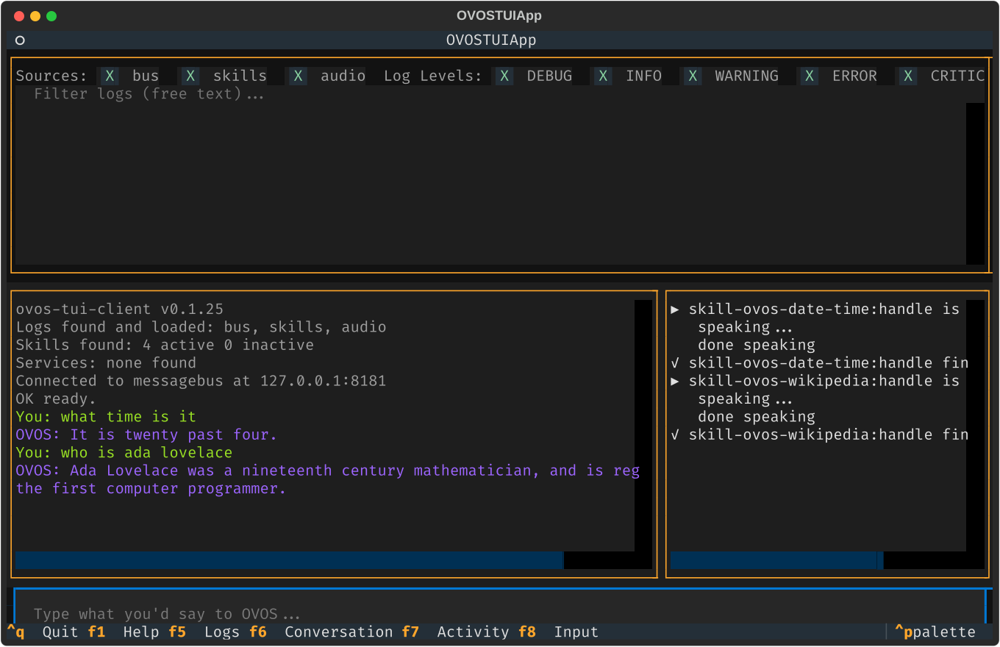

Virtualenv installs get it in the box — `~/.venvs/ovos/bin/ovos-tui` and you
are talking to it. Container installs run it as a container too;
[Running it](docs/terminal-client.md) has both.

## Everyday tasks

| I want to… | Do this |
| --- | --- |
| Update | Re-run the installer and answer **No** to "uninstall?" |
| Start, stop or check the services | See [Managing OVOS](docs/services.md) |
| Change settings | Edit `~/.config/mycroft/mycroft.conf` |
| Fix a microphone that mishears | [Calibrate it](docs/troubleshooting.md#the-assistant-does-not-answer) |
| Install without answering questions | See [Automation](docs/automation.md) |
| Uninstall | Re-run the installer and answer **Yes** to "uninstall?" |

Back up `~/.config/mycroft/mycroft.conf` (or `~/ovos/config/mycroft.conf` for
container installs) before updating or uninstalling if you want to keep your
settings.

## Who is running it

From installs that accepted **installer telemetry**, which is one of the two
questions the installer asks about sharing data — this one, sent to
`telemetry.smartgic.io` while the install runs, and separately usage metrics,
sent elsewhere during normal use. Both are off unless you accept them, and
[Telemetry](docs/telemetry.md) lists exactly what each one sends.

The numbers update on their own. The
[live dashboard](https://telemetry.smartgic.io/ovos-installer/dashboard/) has
the interactive version.

<picture>
  <source media="(prefers-color-scheme: dark)" srcset="docs/images/telemetry-os-dark.svg">
  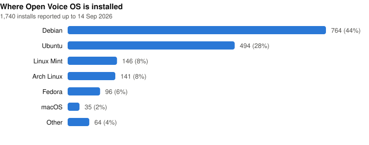
</picture>

<picture>
  <source media="(prefers-color-scheme: dark)" srcset="docs/images/telemetry-features-dark.svg">
  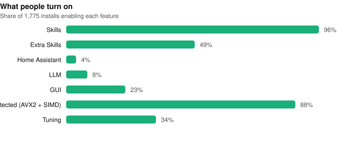
</picture>

## Will it run on my machine?

Most likely yes. The installer is tested on Debian, Ubuntu and their
derivatives (including Raspberry Pi OS and Linux Mint), Fedora and the
Enterprise Linux family, Arch and its derivatives, openSUSE, WSL2, and macOS on
both Intel and Apple Silicon.

[The full list of tested versions](docs/supported-systems.md) has the details,
including which combinations macOS supports.

## Documentation

- [Terminal client](docs/terminal-client.md) — talk to OVOS without a microphone
- [Managing OVOS](docs/services.md) — starting, stopping and checking services
- [Automation](docs/automation.md) — unattended installs and every setting
- [macOS](docs/macos.md) — extra setup Macs need
- [Supported systems](docs/supported-systems.md) — tested distributions
- [Troubleshooting](docs/troubleshooting.md) — when something goes wrong
- [Telemetry](docs/telemetry.md) — what the optional data sharing sends
- [How it works](docs/architecture.md) — for people changing the installer

## Screenshots

<details>
<summary>The screens the installer walks through</summary>

Rendered from the installer itself by `scripts/render_screenshots.py`, so they
stay in step with it.

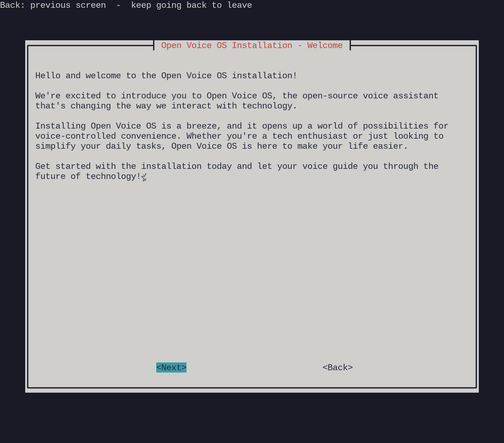

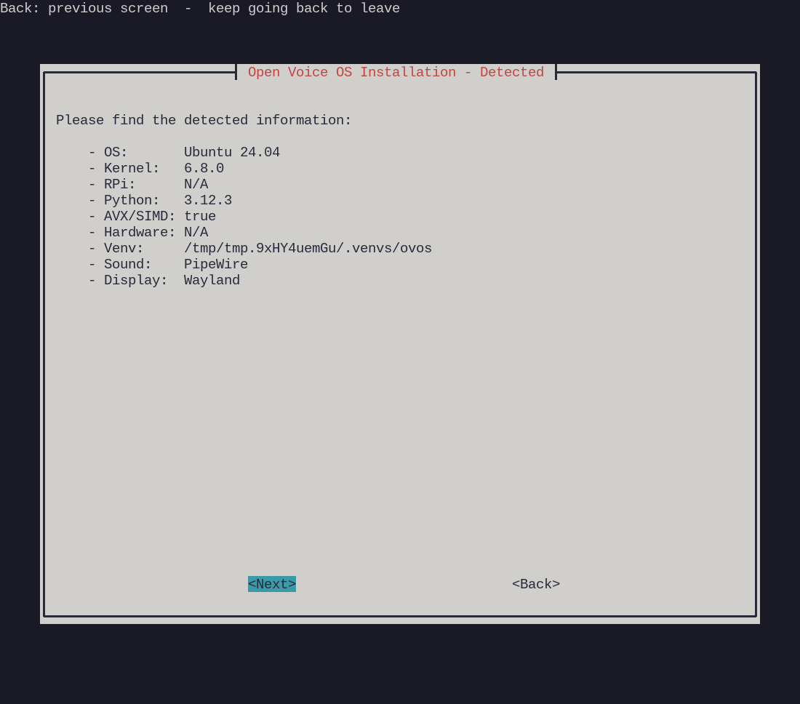

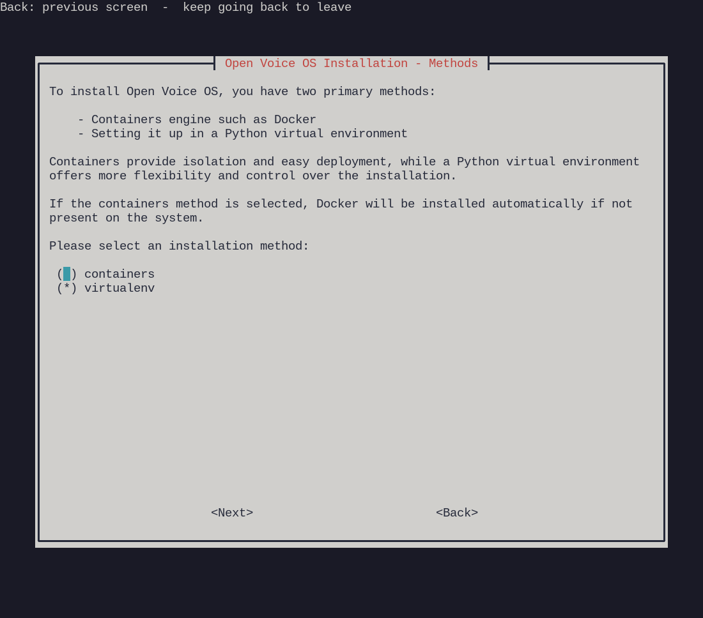

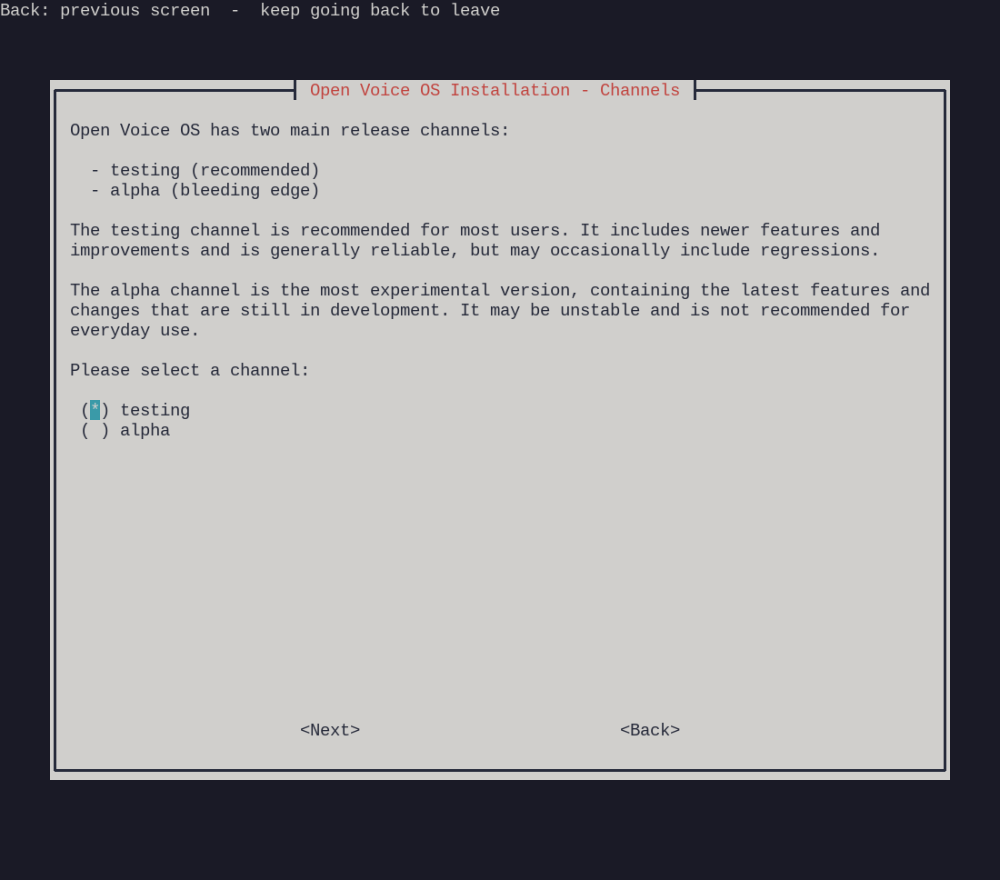

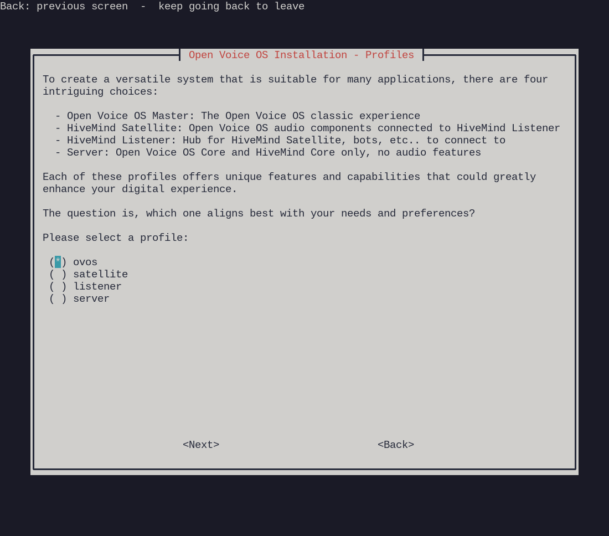

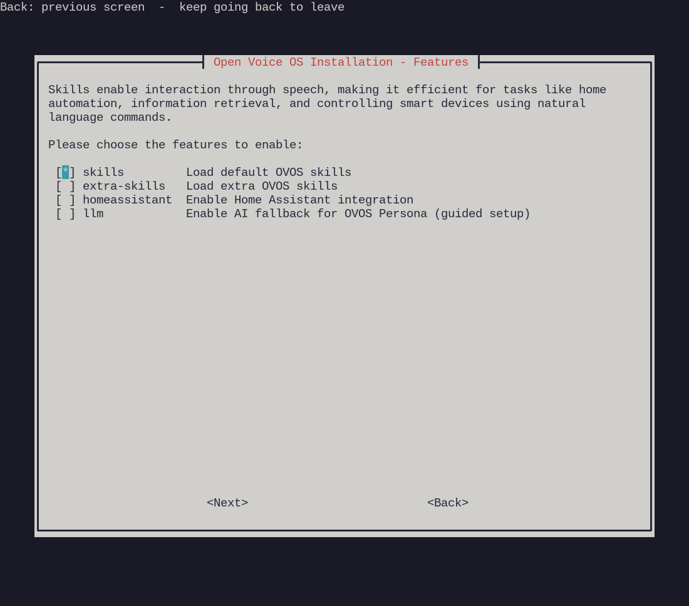

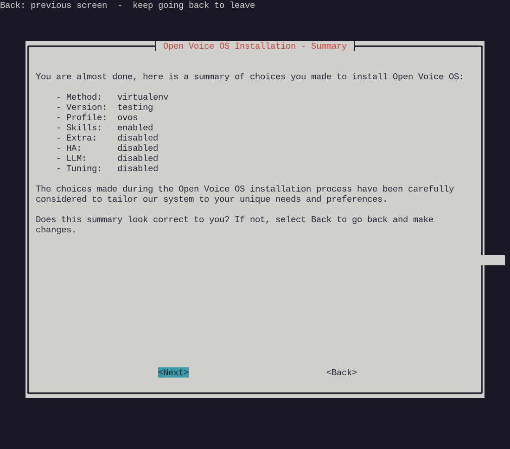

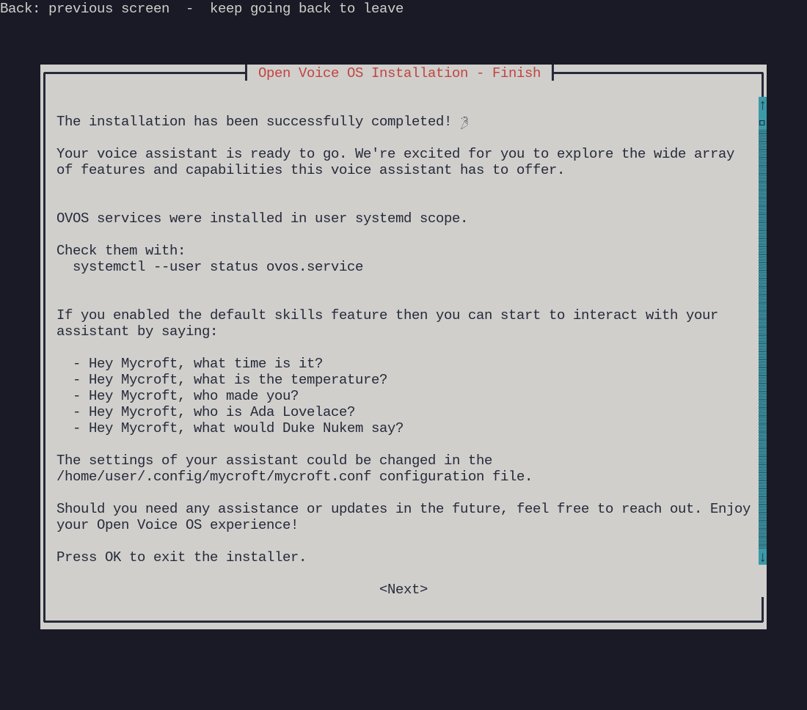

</details>

## Related projects

- [ovos-core](https://github.com/OpenVoiceOS/ovos-core) — the assistant this installs
- [HiveMind-core](https://github.com/JarbasHiveMind/HiveMind-core) — distributed voice across several devices, which this can also set up
- [raspOVOS](https://github.com/OpenVoiceOS/raspOVOS) — a prebuilt Raspberry Pi image, if you would rather flash a card than run an installer
