# OpenVoiceOS Installer

This installer sets up **OpenVoiceOS (OVOS)**, an open-source voice assistant,
on a Raspberry Pi, Linux computer or supported Mac.

It checks your device, asks a few questions, then installs the software and
sets up speech, skills, sound and background services. You can also choose
optional features such as Home Assistant or an AI assistant.

## Install

Before starting, you need:

- A [supported system](docs/supported-systems.md) and an internet connection.
- `curl`, `git`, `sudo` and **Bash 4 or later** installed on that device.
- On a Mac, complete the [macOS preparation](docs/macos.md) first.

Open Terminal on the device you want to use and run:

```sh
sudo sh -c "$(curl -fsSL https://raw.githubusercontent.com/OpenVoiceOS/ovos-installer/main/installer.sh)"
```

Use the arrow keys and **Enter** to make your choices. **Back** lets you change
an earlier answer. Follow any restart instructions when installation finishes.

## Speech

Speech can use public servers or, on supported hardware with the alpha channel,
run on your device with public fallback. If local recognition fails or returns
no text, the recording is sent to public servers. If a local speech model
cannot run, that part uses public servers instead.
[More about speech settings](docs/automation.md#scenario-settings).

## After installation

With a microphone and speaker connected, try:

> Hey Mycroft, what time is it?

You can also [type to OVOS in a terminal](docs/terminal-client.md).

To **update or uninstall**, run the same install command again and follow the
prompts. Back up your settings first: `~/.config/mycroft/mycroft.conf` for a
virtualenv install, or `~/ovos/config/mycroft.conf` for containers.

## Help

- [Managing OVOS](docs/services.md) — start, stop and check the services
- [Automation](docs/automation.md) — install using saved settings
- [Troubleshooting](docs/troubleshooting.md) — help with installation, sound and microphones
- [Data sharing](docs/telemetry.md) — what the optional telemetry sends
- [How it works](docs/architecture.md) — for contributors

<details>
<summary>Screenshots and community statistics</summary>

### Setup screens

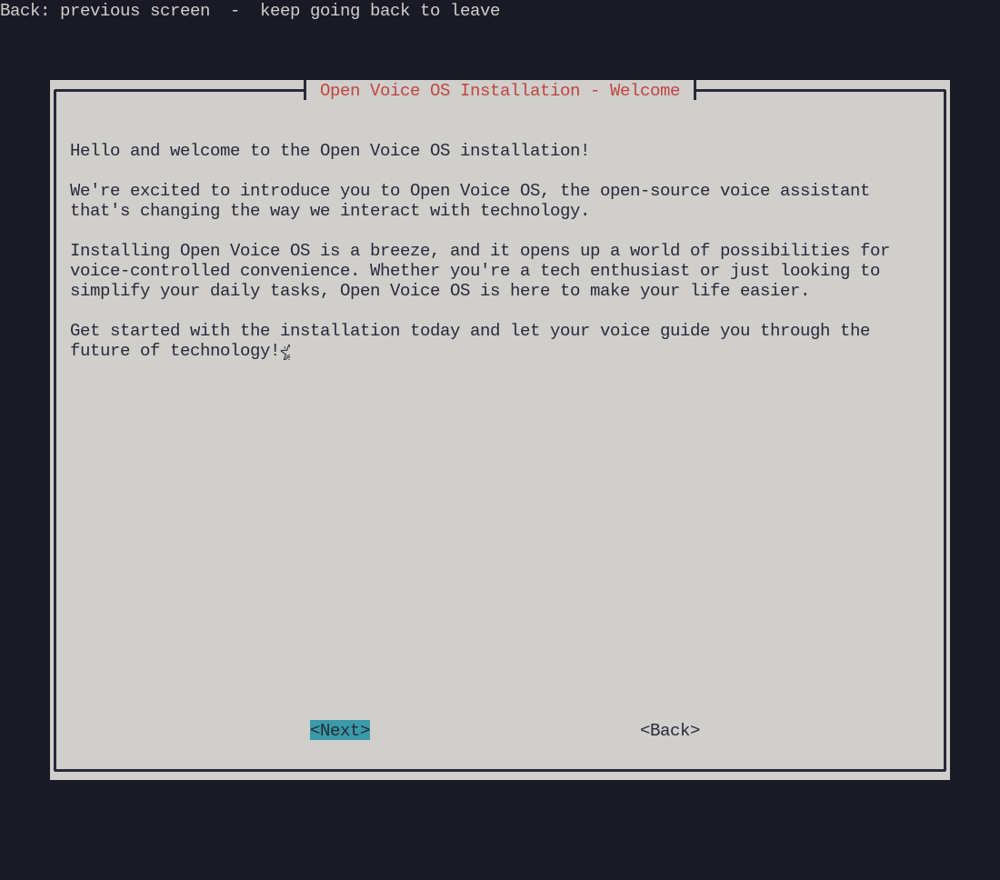

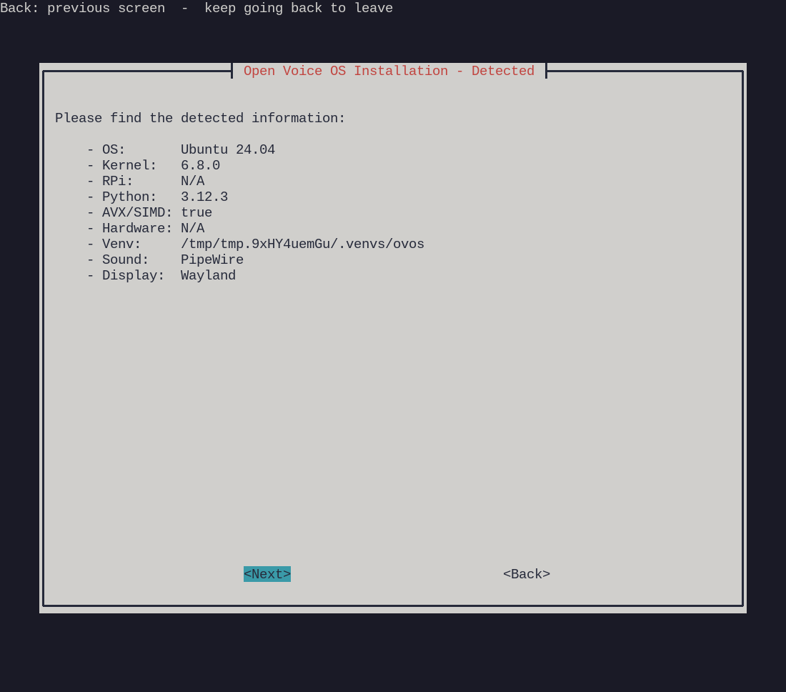

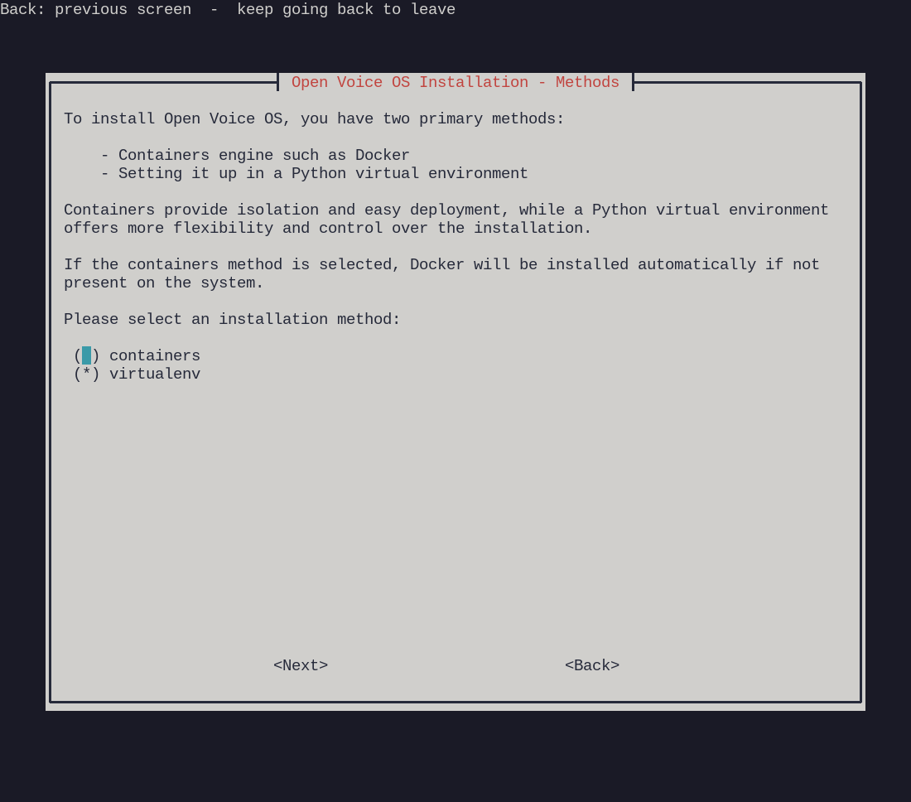

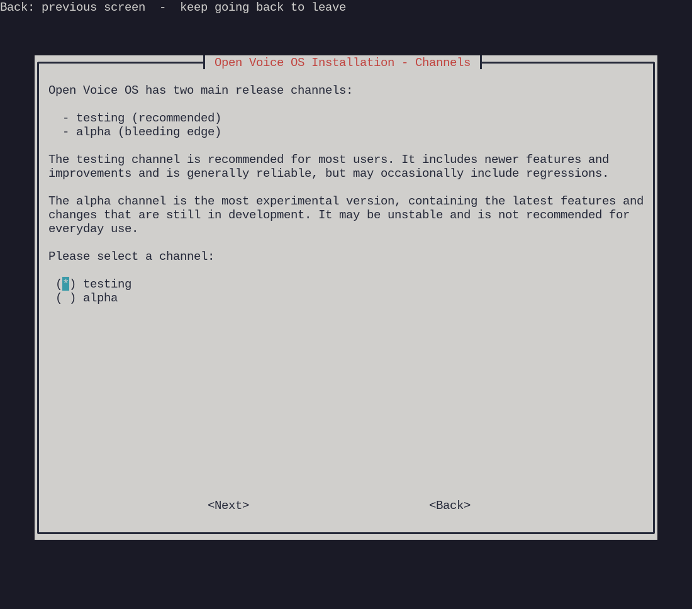

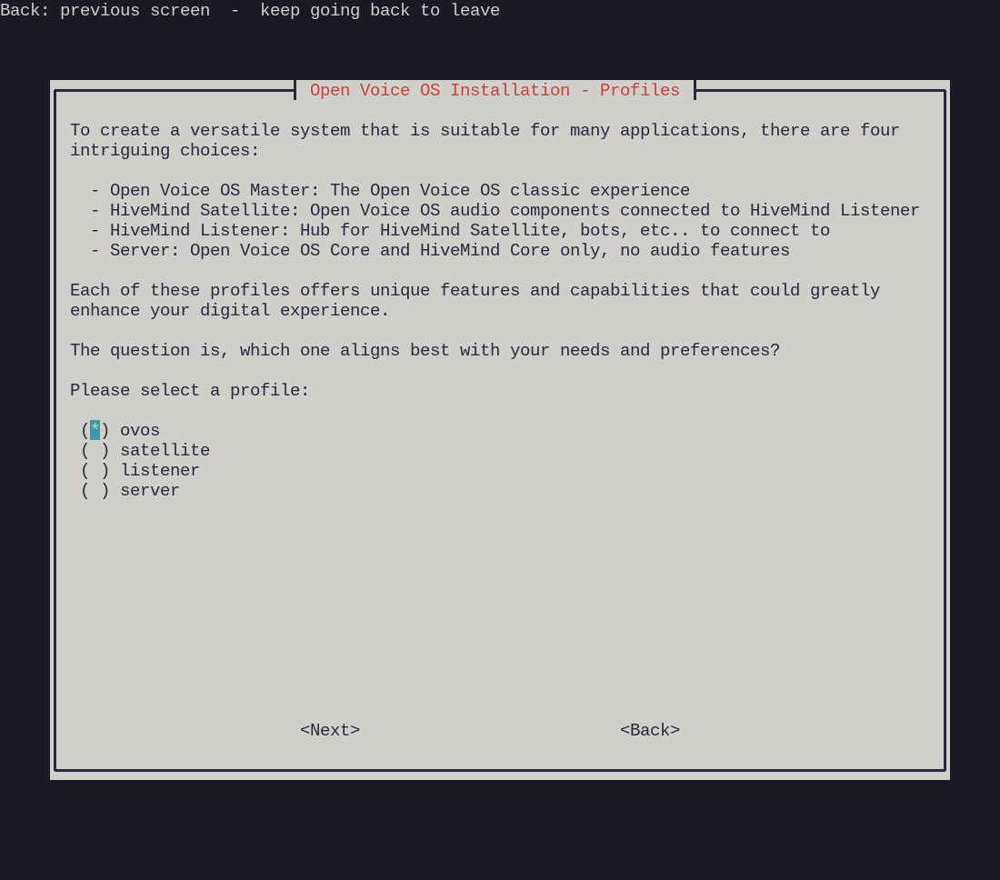

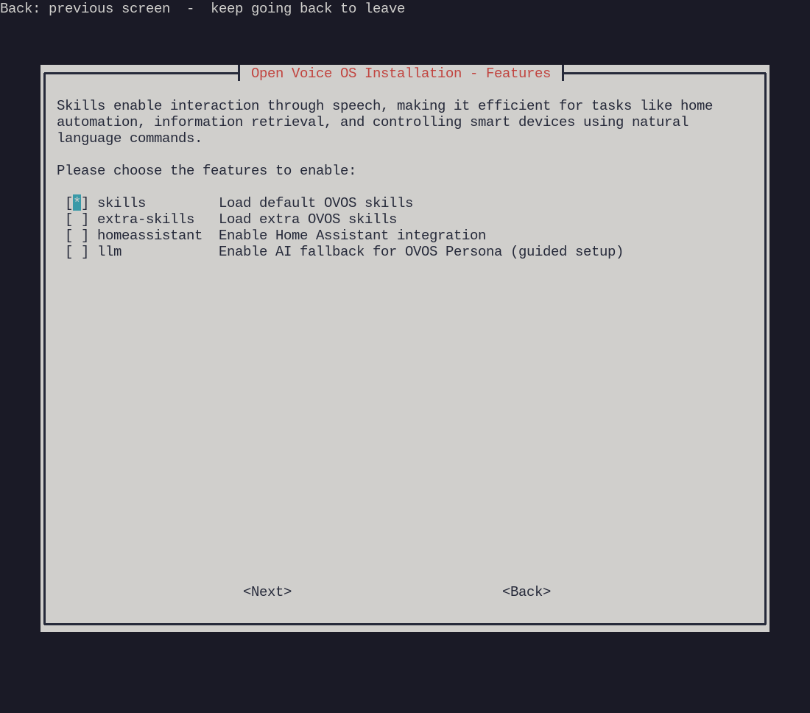

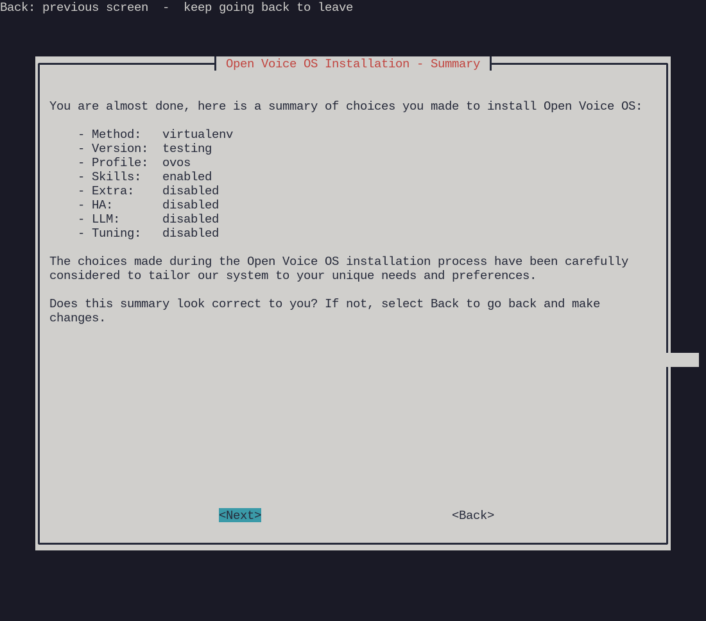

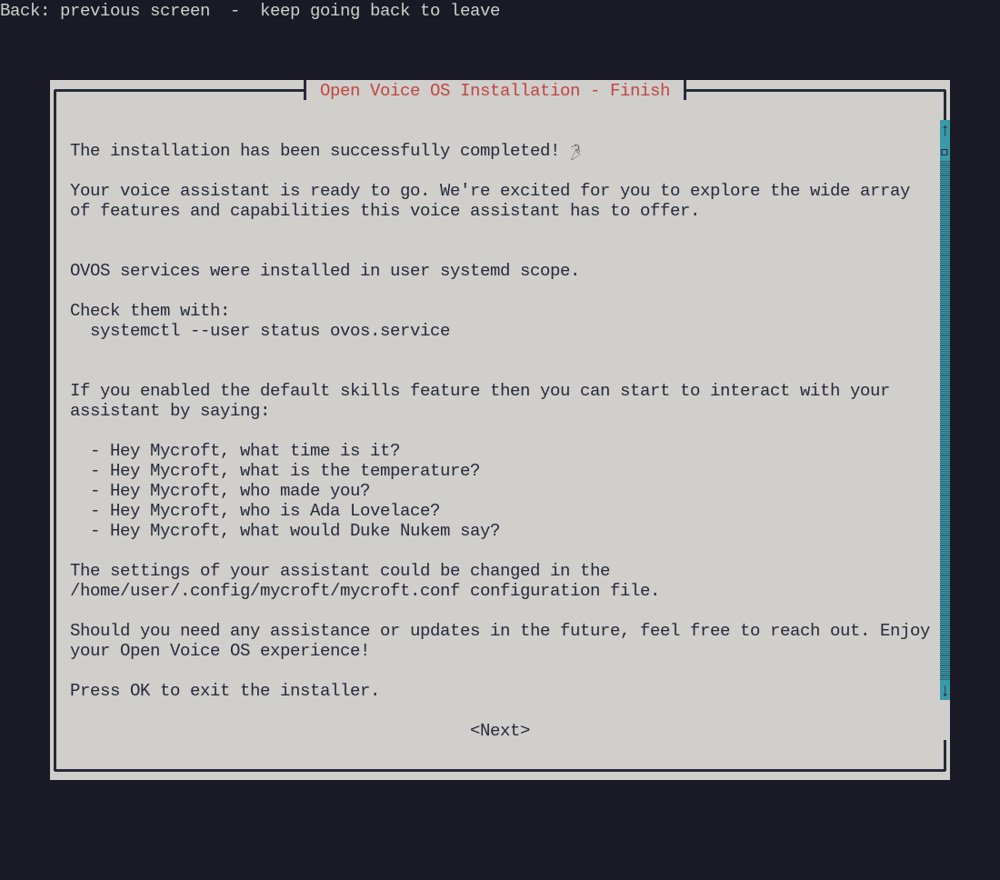

### Terminal client

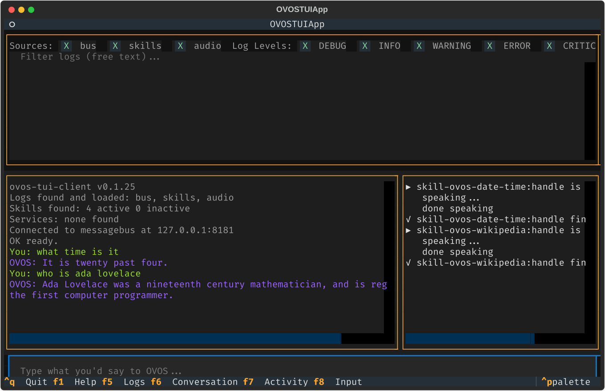

### Community statistics

These figures include installations that opted into installer telemetry.
[Open the dashboard](https://telemetry.smartgic.io/ovos-installer/dashboard/).

[](https://telemetry.smartgic.io/ovos-installer/dashboard/)
[](https://telemetry.smartgic.io/ovos-installer/dashboard/)
[](https://telemetry.smartgic.io/ovos-installer/dashboard/)

<picture>
  <source media="(prefers-color-scheme: dark)" srcset="docs/images/telemetry-os-dark.svg">
  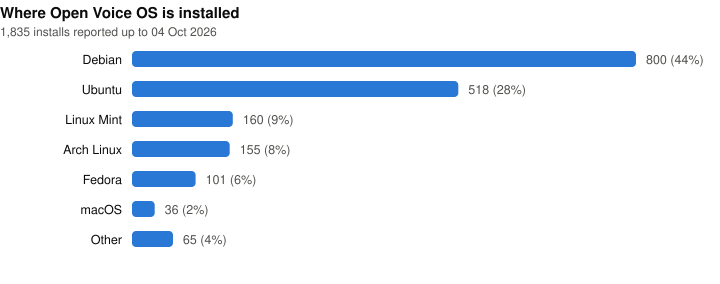
</picture>

<picture>
  <source media="(prefers-color-scheme: dark)" srcset="docs/images/telemetry-features-dark.svg">
  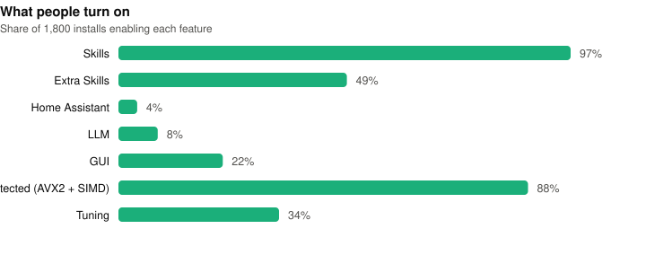
</picture>

</details>
